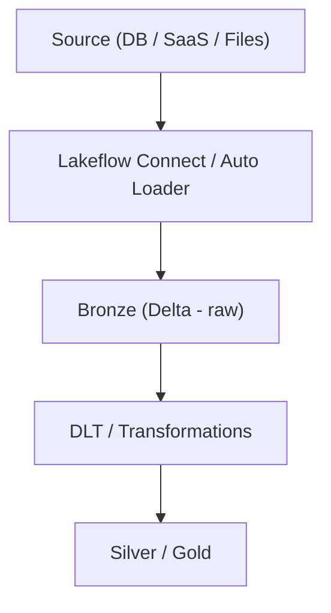

# 🧠 Big Picture First

In Databricks, data ingestion evolved through 5 major phases:

**Manual ingestion → Semi-automated → Incremental/Streaming → Fully managed (Lakeflow)**

---

## 🚀 PHASE 1: Early Days (2015–2018)

**Manual Spark-based ingestion**

**How data was ingested:**

- `spark.read()`
- Custom scripts
- Batch jobs

**Example:**

```python
df = spark.read.parquet("/data/path")
df.write.saveAsTable("table")
```

**Problems:**

- ❌ Reprocessing same data
- ❌ No tracking of processed files
- ❌ No incremental logic
- ❌ High operational overhead

👉 Everything was DIY (Do It Yourself)

---

## 🚀 PHASE 2: COPY INTO (Batch Incremental)

Databricks introduced:

**COPY INTO**

```sql
COPY INTO table FROM '/path'
```

**What changed:**

- ✅ Tracks already loaded files
- ✅ Avoids duplicates
- ✅ Incremental ingestion

**Internally:**

- Maintains metadata of ingested files
- Skips already processed ones

**Limitations:**

- ❌ Only for file-based ingestion
- ❌ No streaming
- ❌ No complex pipelines

---

## 🚀 PHASE 3: Auto Loader (Game Changer 🔥)

Built on Structured Streaming

**Key feature:**

- 👉 Incremental file ingestion at scale

From docs:

> Auto Loader “only ingest[s] the new data that arrived since the previous run”

**Example:**

```python
spark.readStream \
        .format("cloudFiles") \
        .load("/data")
```

**What it solved:**

- ✅ Handles millions/billions of files
- ✅ Exactly-once processing
- ✅ Schema evolution
- ✅ Near real-time ingestion

**Internals:**

- Checkpointing
- File notification / listing
- State tracking

**Limitation:**

- Still requires code and pipeline orchestration

---

## 🚀 PHASE 4: Delta Live Tables (DLT) / Pipelines

Databricks added:

- **Declarative pipelines**

Instead of writing full code:

```sql
CREATE LIVE TABLE bronze AS SELECT ...
```

**What changed:**

- ✅ Built-in data quality checks
- ✅ Monitoring
- ✅ Retry logic
- ✅ Handles Bronze → Silver → Gold

**Problem:**

- Still engineering-heavy for ingestion from SaaS/DBs

---

## 🚀 PHASE 5: Lakeflow Connect (Modern Era 🔥🔥🔥)

This is the latest evolution

From docs:

> Lakeflow Connect provides connectors for SaaS apps, databases, files, and more with automation and incremental ingestion

### 🔥 What Lakeflow Connect solves

**Before:**

You had to build:

- Spark jobs
- CDC logic
- Scheduling
- Error handling

**Now:**

- 👉 Fully managed ingestion pipelines

### 🧩 Components of Lakeflow Connect

From docs:

1. **Connection**: Stores credentials (Unity Catalog)
2. **Ingestion pipeline**: Moves data automatically
3. **Destination tables**: Usually streaming Delta tables
4. **(For DB) Ingestion Gateway**: Captures changes continuously

### 🔥 Key Features

- ✅ Incremental ingestion (core concept)
        - First run → full load
        - Next runs → only changes
- ✅ CDC (Change Data Capture): Inserts / Updates / Deletes tracked
- ✅ Serverless pipelines: No cluster management
- ✅ Schema evolution: Automatically handles new columns
- ✅ Built-in orchestration: Uses workflows/jobs automatically

---

## 🧠 Types of ingestion in Lakeflow

### 1️⃣ Fully Managed Connectors (Easiest)

**Examples:**

- Salesforce
- MySQL
- Workday

**Features:**

- No code
- CDC support
- Auto schema evolution

### 2️⃣ Standard Connectors

**More flexible:**

- Files (S3, ADLS, GCS)
- Message queues

**Uses:**

- Auto Loader
- Streaming

### 3️⃣ Custom Pipelines

**Full control:**

- Structured Streaming
- Spark

---

## 🔄 Evolution Summary

| Phase | Tool            | Capability              |
|-------|-----------------|------------------------|
| 1     | spark.read      | Manual batch           |
| 2     | COPY INTO       | Incremental batch      |
| 3     | Auto Loader     | Incremental streaming  |
| 4     | DLT             | Managed pipelines      |
| 5     | Lakeflow Connect| Fully managed ingestion|

---

## 🔥 Real-World Architecture Today

Modern Databricks ingestion looks like:


